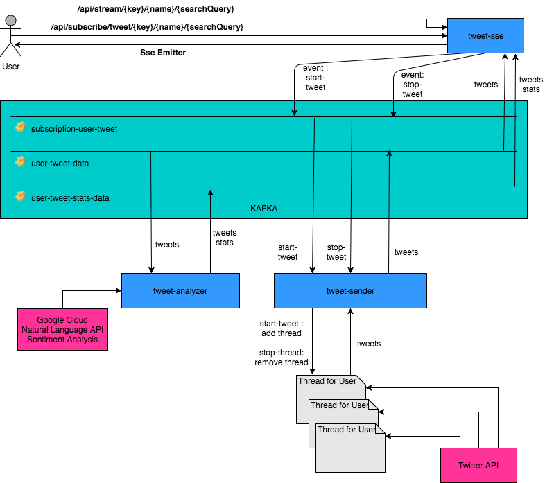

# Tweet Analyzer
## Conception and Architecture

### Front End 
Generated with Angular CLI version 1.0.3
### Microservices
#### Tweet-sse:
Receive tweets and tweet stats and dispatch them to users.

#### Tweet-sender:
Get tweets request of a user, calltweet api and send results to the queue for user.

#### Tweet-analyzer:
For a tweet service send a sentiment object with score between -1 and 1 and magnitude betweent 0 and infinity

## Distributed tracing system
### Zipkin

## Latency and Fault tolerance library
### Hystrix

## Microservice Registration and Discovery
### Eureka 

## Orchestration of Microservices
### Spring Cloud Dataflow
